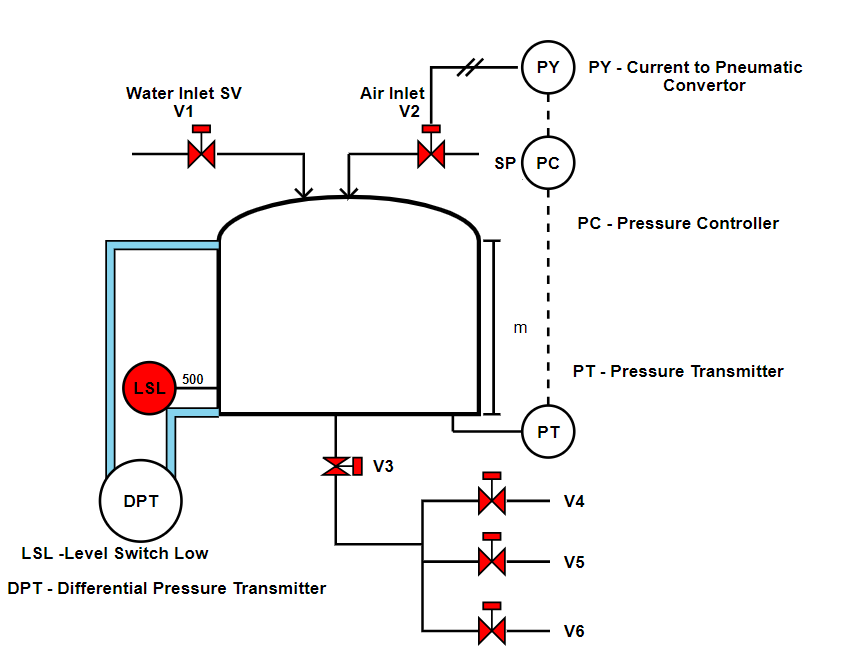

###### The process depicted in the diagram is aimed at "distribution of water at same flow rate in spite of reduction in head of water in tank". The process consists of : 
1.	A tank for storing water
2.	Inlet for water through  solenoid valve V1
3.	Compressed air inlet through  solenoid valve  V2
4.	User outlets through solenoid valves V3, V4,V5,  and V6
5.	Pressure Transmitter PT
6.	Pressure Controller PC
7.	Current to Pneumatic Convertor PY
8.	Low level Switch LSL
It is expected that the user will select the sensors based on the requirements as mentioned in the process diagram. The aim of this plant is to maintain the gravity flow of water in spite reduction in head of water. This is primarily achieved by adjusting the air pressure as marked. 
This experiment need to be performed by the students to understand the selection process of sensor and its effect on performance of the plant. The process description is as follows:
1.	Initially the tank if filled with water for the period for which the supply is available. The head of the water is measured using PT. 
2.	For the distribution of water with same head (As this is a gravity flow tank the flow will decrease as the level of water in the tank is dropped. To maintain the flow, loss of Head is recuperated by the compressed air. This is achieved by opening air solenoid valve V2. The set point is set so as to keep gravity flow to every user same. 
3.	Various scenarios can be tested such as no water through inlet still water demand is to be met, at a time all the users will be using or few are using the water etc.  Based on this the operation of the plant can be tested.
4.	If water level goes below LSL then the plant needs to be automatically tripped else the water line will be filled with compressed air.
Conclusion: Once the plant operation is understood by the students, they can assess the effect of selection of right kind of sensor on the performance of the plant.  